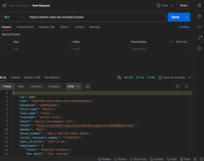
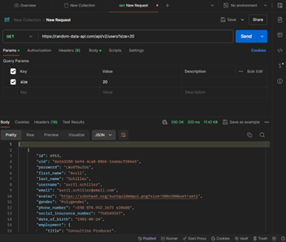
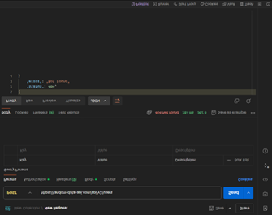
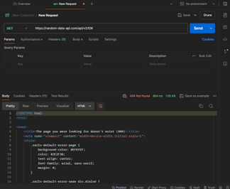
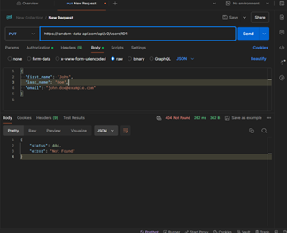

# Postman
Ngày thực hiện 24/5/2024

1. Lựa chọn một API thực tế để kiểm thử. 

API: https://random-data-api.com/api/v2/users

2. Phân tích tài liệu API để hiểu rõ các chức năng và điểm cuối của API. 

Điểm cuối: users

3. Viết các trường hợp kiểm thử cho các chức năng chính của API. 

Kiểm tra xem có thể lấy dữ liệu người dùng ngẫu nhiên hay không.

Kiểm tra xem có thể lấy dữ liệu người dùng với số lượng cụ thể hay không (sử dụng tham số size).

4. Sử dụng Postman để thực hiện các trường hợp kiểm thử. 

Mục tiêu kiểm thử: Đánh giá tính chính xác và khả năng hoạt động của các điểm cuối trong API của Random Data API.

phạm vi kiểm thử: Kiểm thử các điểm cuối: /users.

                              Các phương thức kiểm thử: GET, POST, PUT 

5. Ghi lại kết quả kiểm thử và xác định các lỗi hoặc vấn đề. 

a, Dữ liệu người dùng ngẫu nhiêu: Pass, API : 200 OK

b, truy xuất nhiều người dùng: Pass, API: 200 OK

c, Phương pháp không hợp lệ: pass, API: 404 not found

d, URL không hợp lệ: Pass, API: 404 not found

e, add : not pass, API: 404 not found

